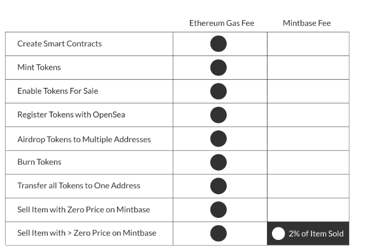

# Fee Structure

Mintbase only takes a 2% fee when you set an item for sale for &gt; $0.  

If you don't set an item for sale, it doesn't cost you anything.

The user needs to pay his or her own [gas fee anytime.](../getting-started/ethereum-gas-fee.md) anytime they change the state of the smart contract.

