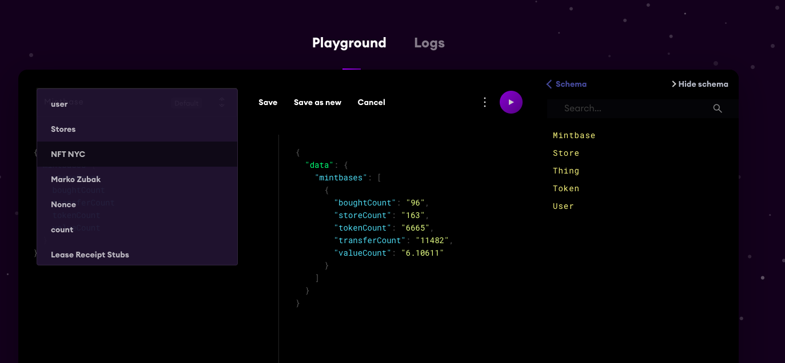
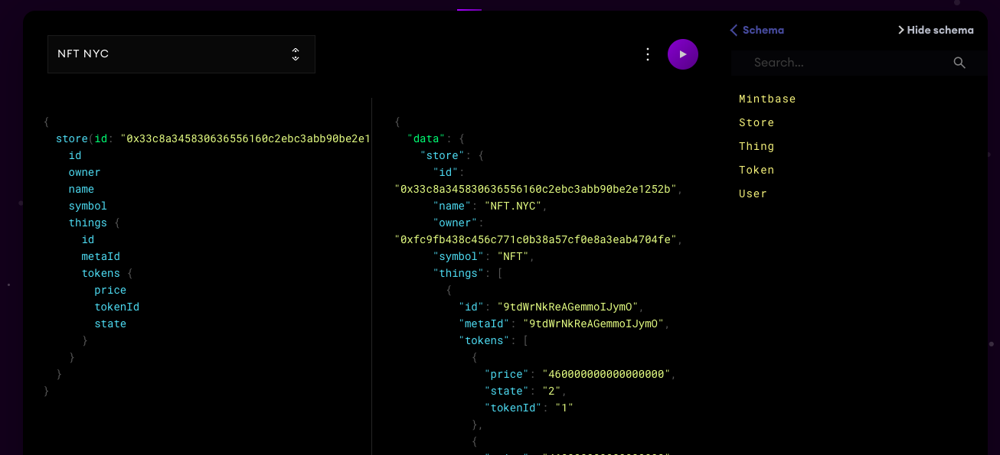

# API

### Using TheGraph

[TheGraph](https://thegraph.com/) is an Ethereum indexer that stores aggregated data on [IPFS](https://ipfs.io/). When you change the state of the blockchain \(mint, transfer, buy\) an event is emitted and then [organized](https://github.com/Mintbase/graph-mint-factory) by our [open sourced mapping tool.](https://github.com/Mintbase/graph-mint-factory) Our entire interface hooks into the open websocket and updates on confirmations. You can also build your own reporting systems from this.

* [Mainnet SubGraph](https://thegraph.com/explorer/subgraph/nategeier/mintbase)
* [Rinkeby SubGraph](https://thegraph.com/explorer/subgraph/nategeier/mint-factory)

```text
// Websocket
wss://api.thegraph.com/subgraphs/name/nategeier/mintbase

// Query
https://api.thegraph.com/subgraphs/name/nategeier/mintbase

```

  

### Tracking Your Store

[Click the drop down here ](https://thegraph.com/explorer/subgraph/nategeier/mintbase?query=NFT%20NYC)and you can see example, but just enter your created contract \(make sure it's all lowercase\) 







Token Metadata



This endpoint allows you to get free cakes.






The API will do its best to find a cake matching the provided recipe.







Cake successfully retrieved.


```
{    "name": "Cake's name",    "recipe": "{"external_link":"https://mintbase.io/minted//AjhIBQnLPtJxcSlow5Ym","contractAddress":"","type":"ERC721","attributes":[{"value":"Earlybird Access","trait_type":"item"},{"value":2,"trait_type":"level"},{"value":1,"trait_type":"generation","display_type":"number"}],"price":"1.23","isForSale":true,"description":"","image":"https://firebasestorage.googleapis.com/v0/b/thing-1d2be.appspot.com/o/token%2Fasset-1574887714518?alt=media&token=21d3a2a6-55ba-4651-8c12-768b4d3df0f2","minted":"Minted on Mintbase.io","name":"Earlybird Access","minter":"0xfc9FB438c456C771c0B38a57Cf0e8A3eaB4704fE","id":null,"mintedOn":{"_seconds":1574887720,"_nanoseconds":743000000}} recipe name",    "cake": "Binary cake"}AjhIBQnLPtJxcSlow5Ym
```




Could not find a cake matching this query.


```
{    "message": "Ain't no cake like that."}
```






