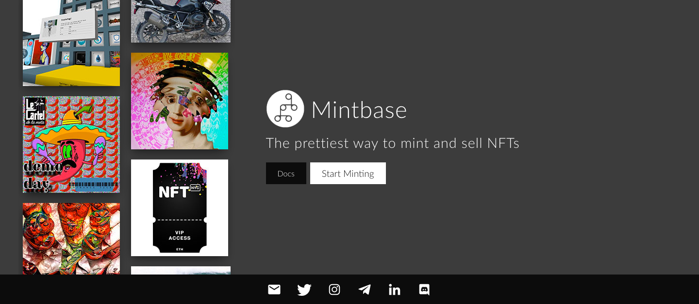
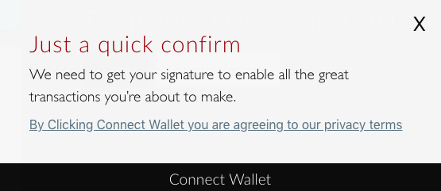
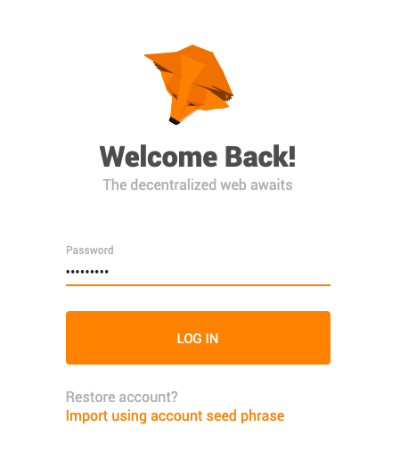
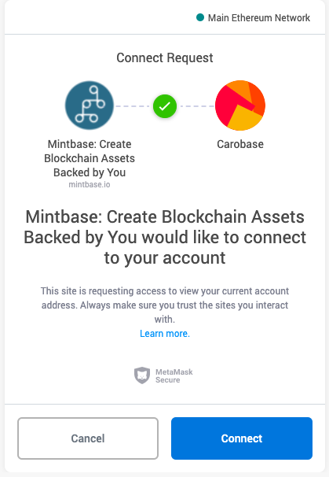
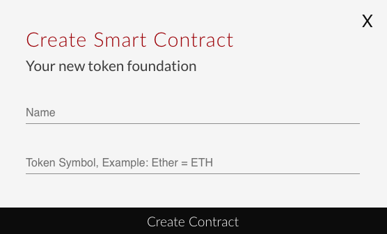
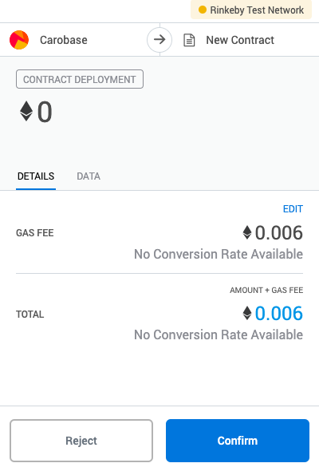

# Creating a Smart Contract

### Quick notes:

* The account of the creator of the smart contract will receive all funds of any NFTs sold on Mintbase
* You can deploy and manage as many smart contract as you want

#### 1. Go to [Mintbase](https://mintbase.io/).

**2. Click "Start Minting".**

**3. Connect your digital wallet.**

**4. Sign into your digital wallet. In the example below, we connected to MetaMask wallet.**

**5. Click "Connect" to connect Mintbase with your digital wallet.**

**6. Create your smart contract or store. This means that you can create several stores which hold different products.**

**7. Confirm the** [**gas fee**](https://blockgeeks.com/guides/ethereum-gas/)**. It is a price the Ethereum blockchain takes for the transaction.** 

**Do not "Speed up" the transaction!** Once you speed it up, we lose the connection from the code. If you do this, please contact support and we can find it manually. We are very reachable on Telegram [https://t.me/mintbase](https://t.me/mintbase)

Please note that you can find more information on the gas fee in our [FAQs](ethereum-gas-fee.md).

**The amount will be deducted from your wallet.**

**8.  Select "Mint Token" to publish new products/items in your store. You can also handle different campaigns by creating different stores.**

