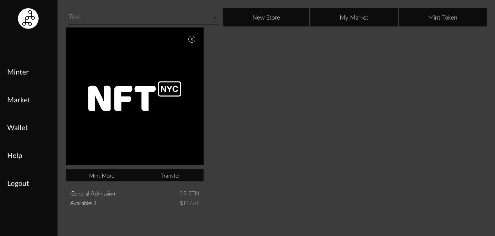

# Burning Tokens

If you want to delete your item, you can simply click the cross at the top right corner of your image. You will have to confirm with your wallet. _Once the tokens are burned, you cannot get them back!_

