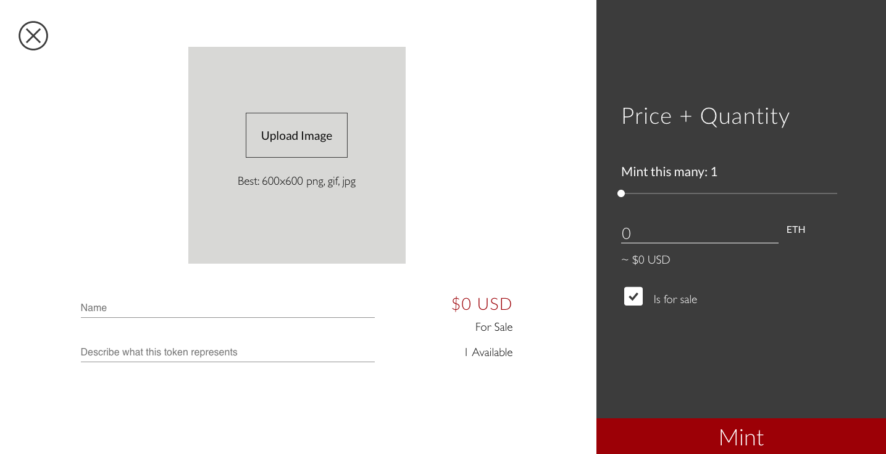
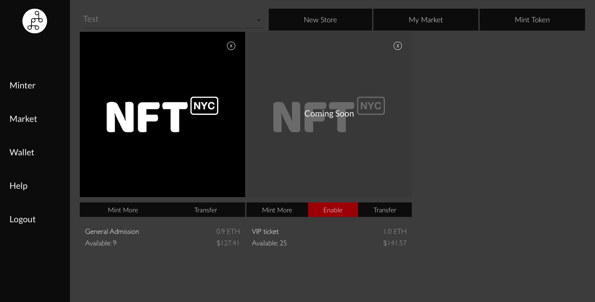

# Tokens For Sale

Simply click the right box to "Is for Sale" to put an item on sale.

You cannot disable the sale of the item once the item is created, but you can enable them once minted.

### Enabling Tokens for Sale on Mintbase

