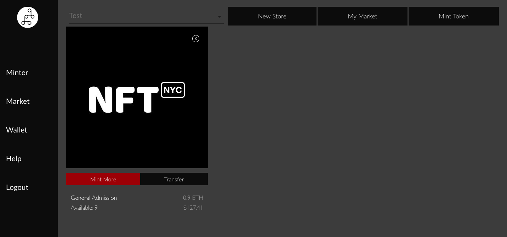
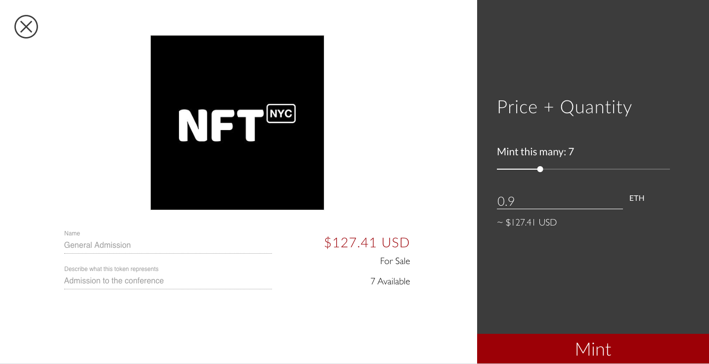

# Minting More

### Click "Mint More" in the Minter

If you want to create more items after you have minted a batch,  just click "Mint More" 

### Drag the amount you want

The metadata cannot change and the form is disabled, but you can drag the "Mint this many" tool.

Once you have the right amount, click "Mint"

