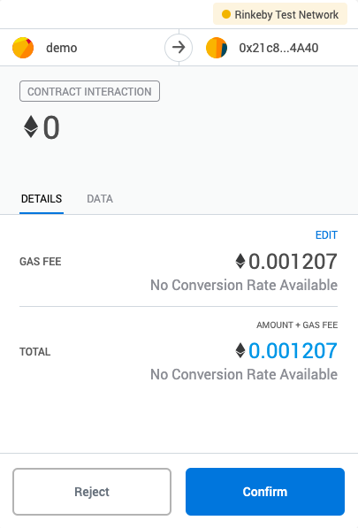
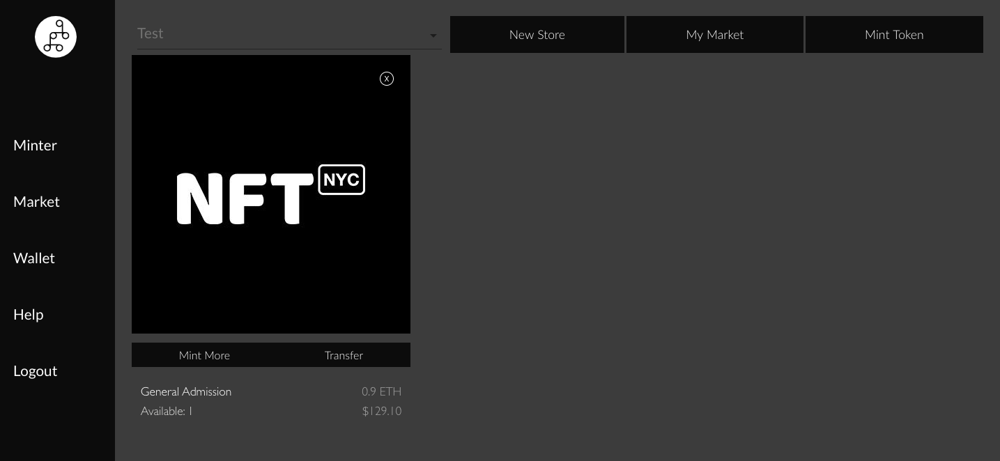
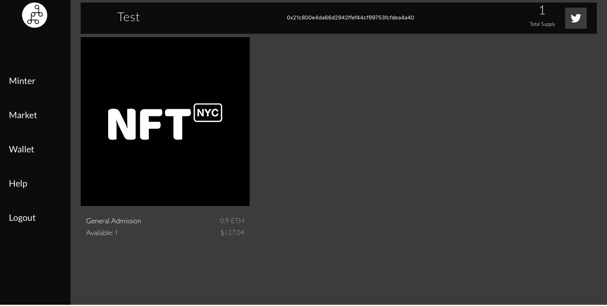

# Minting

### Press "Mint Token" on your Dashboard

### Enter the product/ NFT details

Select the name of the  NFT and a description. On the right hand side, you can enter the price and whether your product is for sale or not.

\(Ticket, Product, Membership\) 

### Select "Mint" to publish the item in your shop

Note that you can not change the price after having published your item. You can upload an image, soon we will also allow you to add videos and other properties. You can determine how many products or items you want to create by dragging the bar under "Mint this many". If you are minting a product for sale, please select the "Is for Sale" button and choose a price. Please note that the conversion is fluctuating real-time with the ETH price. If you want to create a free item, unselect the box "Is for Sale".

### **Confirm the gas fee on your digital wallet.**

The new token should pop up and the screen will leave when the transaction confirms

### **My Market**

If you click "My Market", this is the open link you can send to your customers to sell your products. 

You can also embed this market in your own website \(Squarespace, Wordpress, HubSpot, or custom\) s[ee our docs on this](https://docs.mintbase.io/getting-started/embedding-nfts).

