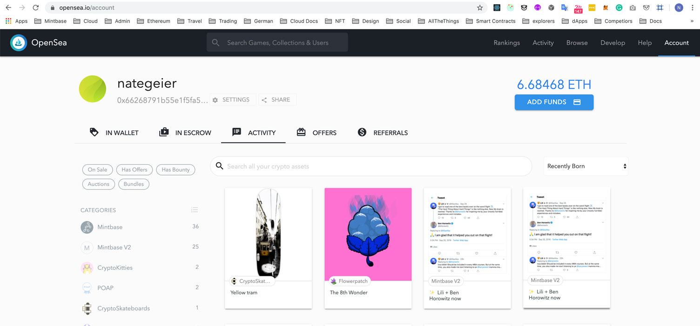
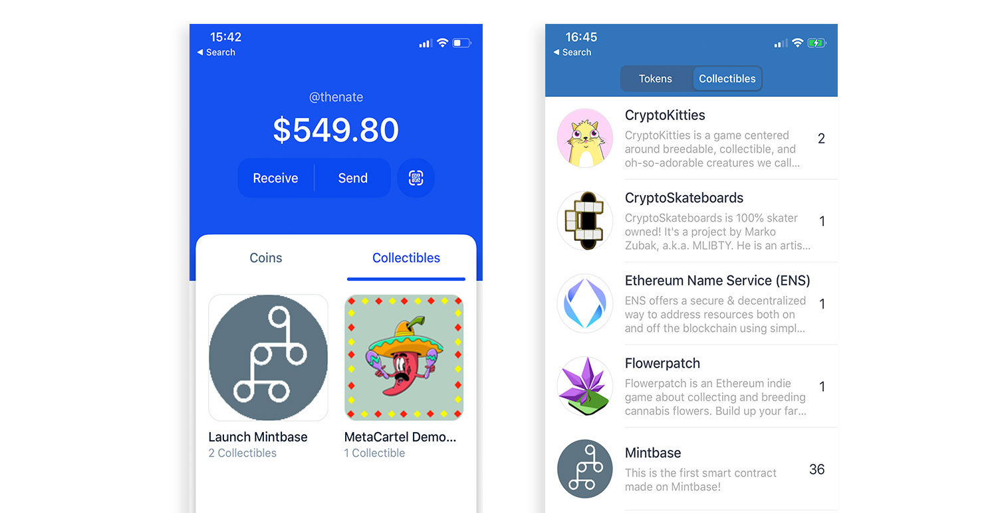
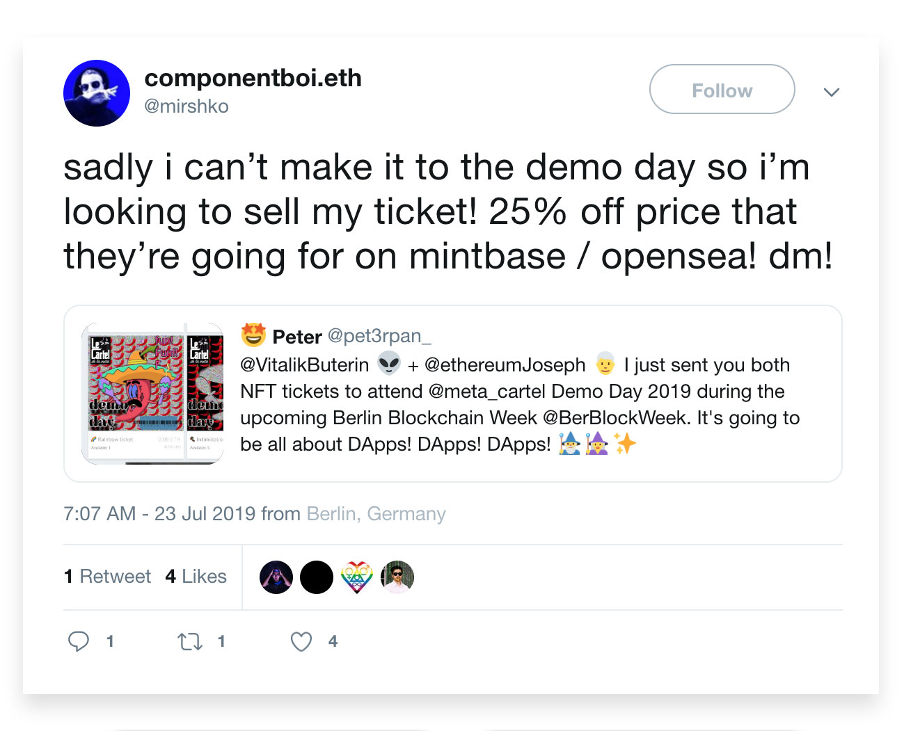

# OpenSea Integration

### Interoperability!

Once you create a smart contract on Mintbase, we immediately register it with [OpenSea](https://opensea.io/) behind the scenes. So as you mint tokens on Mintbase  you can immediately look at ["My Items"](https://opensea.io/account) in OpenSea and they will appear without the need to send them anywhere \(make sure you are on the right network\). 

### Creating a Storefront

In order to see your logo appear in the collectables sections of most wallets like Trust Wallet or Coinbase Wallet, you need to [edit your storefront with them](https://opensea.io/storefronts).  Find your token then click and follow the steps to add a thumbnail.

### Other benefits

You can sell your assets for dai, run auctions, and works great for secondary markets. For example a ticket sold on Mintbase was later sold on OpenSea from a Twitter post.

