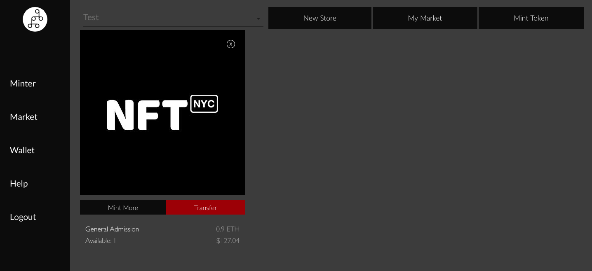
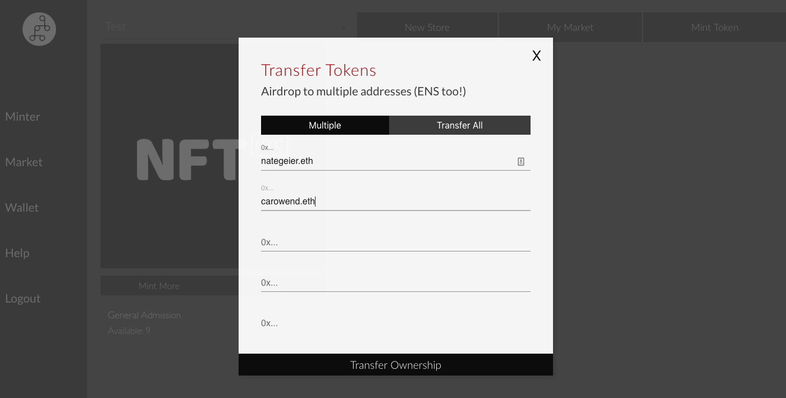
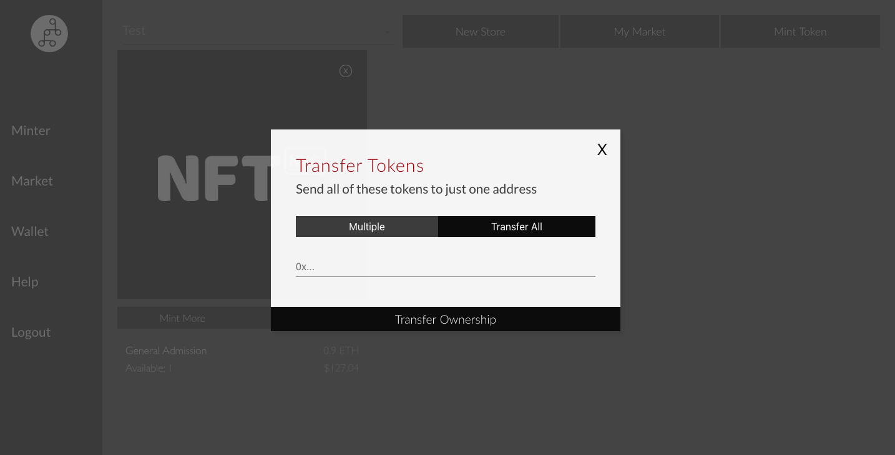

# Transfer / Airdrop

### 1. Go to Minter or My Things

You can find "Minter" or "My Things" at the navigation bar on the left hand side.

### 2. Click Transfer

Please note that only the owner of the tokens can transfer them.

### 3. Add the Addresses 

We support ENS or 0x ETH Addresses. Warning: Make sure the end user has a wallet that supports ERC-721s before sending.

### 4. Transferring all batched tokens to one address

If you want to transfer all of your single item tokens, you can click "One Address" and all of that one type, say all general admission tickets will transfer ownership.

